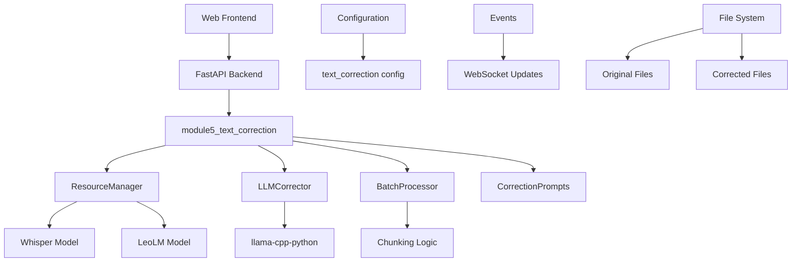
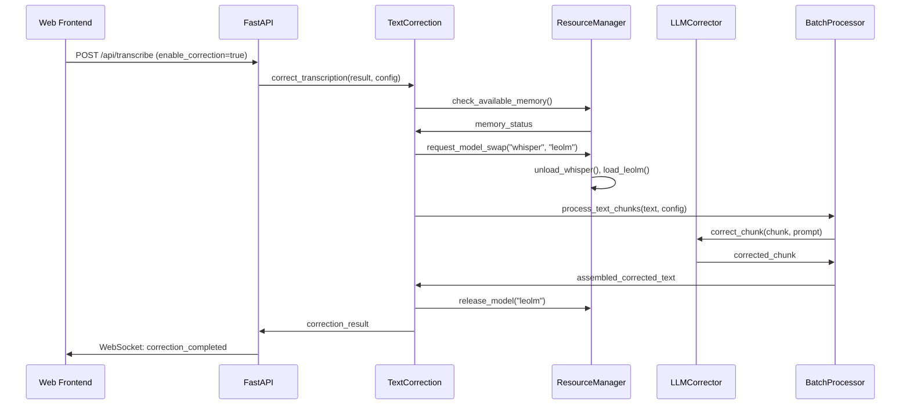

# Design Document

## IMPLEMENTIERUNGSRICHTLINIEN FÜR CLAUDE

**WICHTIG: Dieses Design muss exakt und vollständig implementiert werden.**

### Implementierungsregeln:
- **Exakte Architektur**: Implementiere die Architektur genau wie spezifiziert
- **Vollständige Klassen**: Alle Klassen und Methoden müssen vollständig implementiert werden
- **Echte Dependencies**: Verwende echte llama-cpp-python, psutil, etc. - keine Mocks
- **Komplette Error Handling**: Implementiere alle Error-Szenarien aus dem Design
- **Threading & Async**: Korrekte Implementierung aller async/sync Patterns
- **Resource Management**: Vollständige Implementierung des ResourceManager-Patterns

### Architektur-Compliance:
- Alle Sequenzdiagramme müssen im Code abgebildet werden
- Alle Datenmodelle müssen exakt implementiert werden
- Alle Interfaces und APIs müssen vollständig funktionsfähig sein
- Performance-Optimierungen müssen implementiert werden
- Security-Considerations müssen umgesetzt werden

## Overview

Das module5_text_correction erweitert das Whisper Transcription Tool um automatische LLM-basierte Textkorrektur. Das Design folgt einer modularen Architektur mit klarer Trennung zwischen Ressourcenverwaltung, Textverarbeitung und Frontend-Integration. Die Implementierung nutzt llama-cpp-python für lokale LeoLM-13B Inferenz und integriert sich nahtlos in den bestehenden Transkriptions-Workflow.

## Architecture

### High-Level Architecture



### Component Interaction Flow

#### Happy Path Flow


#### Error Handling Flows

**Insufficient Memory Scenario:**
1. `TC->RM: check_available_memory()` returns insufficient RAM
2. `TC->API: correction_skipped_result` with error details
3. `API->UI: WebSocket: correction_error` with INSUFFICIENT_MEMORY code
4. UI displays warning message and continues with original transcription

**Model Loading Failure:**
1. `RM->RM: load_leolm()` fails due to model corruption/missing
2. `RM->TC: ModelLoadError` exception
3. `TC->API: correction_skipped_result` with fallback to original
4. `API->UI: WebSocket: correction_error` with MODEL_LOAD_FAILED code

**LLM Inference Error:**
1. `LLM->BP: LLMInferenceError` for specific chunk
2. `BP->TC: partial_correction_result` with failed chunks marked
3. `TC->API: partial_correction_result` with warnings
4. `API->UI: WebSocket: correction_completed` with partial success flag

## Components and Interfaces

### 1. Core Module Structure

#### module5_text_correction/__init__.py
```python
from typing import Dict, Optional, Tuple
import asyncio
from concurrent.futures import ThreadPoolExecutor
from ..core.models import TranscriptionResult
from ..core.config import Config

async def correct_transcription(
    result: TranscriptionResult, 
    config: Config
) -> Tuple[TranscriptionResult, Optional[TranscriptionResult]]:
    """
    Orchestrates text correction process asynchronously
    
    Execution Strategy:
    - Uses ThreadPoolExecutor for CPU-intensive LLM operations
    - Maintains async interface for FastAPI compatibility
    - Handles resource management and error recovery
    
    Returns: (original_result, corrected_result)
    """
    
def correct_transcription_sync(
    result: TranscriptionResult, 
    config: Config
) -> Tuple[TranscriptionResult, Optional[TranscriptionResult]]:
    """
    Synchronous version for CLI usage
    Returns: (original_result, corrected_result)
    """
    
def is_correction_available(config: Config) -> Dict[str, any]:
    """
    Checks if correction is available and returns status
    Returns: {available: bool, model_path: str, required_ram: int, error: str}
    """
```

#### llm_corrector.py
```python
from typing import Optional, Dict, List
import llama_cpp
from .correction_prompts import get_correction_prompt

class LLMCorrector:
    def __init__(self, model_path: str, config: Dict):
        self.model_path = model_path
        self.context_length = config.get("context_length", 2048)
        self.temperature = config.get("temperature", 0.3)
        self.llm: Optional[llama_cpp.Llama] = None
    
    def load_model(self) -> bool:
        """Load LeoLM model with error handling"""
        
    def unload_model(self) -> None:
        """Safely unload model and free memory"""
        
    def correct_text(self, text: str, correction_level: str, language: str = "de") -> str:
        """Correct text using loaded LLM model"""
        
    def get_context_length(self) -> int:
        """Get actual context length from loaded model"""
        
    def estimate_tokens(self, text: str) -> int:
        """Estimate token count for chunking decisions"""
```

#### correction_prompts.py
```python
from typing import Dict
from enum import Enum

class CorrectionLevel(Enum):
    LIGHT = "light"
    STANDARD = "standard" 
    STRICT = "strict"

class PromptTemplates:
    SYSTEM_PROMPTS = {
        "light": "Du bist ein Assistent für Rechtschreibkorrektur...",
        "standard": "Du bist ein Assistent für Grammatik- und Rechtschreibkorrektur...",
        "strict": "Du bist ein Assistent für umfassende Textkorrektur..."
    }
    
    USER_PROMPTS = {
        "correction": "Korrigiere folgenden Text: {text}",
        "dialect_normalization": "Wandle Dialekt in Hochdeutsch um: {text}"
    }

def get_correction_prompt(level: str, text: str, dialect_mode: bool = False) -> Dict[str, str]:
    """Generate system and user prompts for correction"""
    
def get_available_levels() -> List[str]:
    """Return list of available correction levels"""
```

#### batch_processor.py
```python
from typing import List, Iterator, Callable, Dict, Optional
from dataclasses import dataclass
import asyncio
from concurrent.futures import ThreadPoolExecutor

@dataclass
class TextChunk:
    text: str
    index: int
    start_pos: int
    end_pos: int
    overlap_start: int = 0  # Characters overlapping with previous chunk
    overlap_end: int = 0    # Characters overlapping with next chunk

class BatchProcessor:
    def __init__(self, max_context_length: int, overlap_sentences: int = 1):
        self.max_context_length = max_context_length
        self.overlap_sentences = overlap_sentences
        self.tokenizer_strategy = "sentencepiece"  # fallback: "nltk"
    
    def chunk_text(self, text: str, tokenizer_fn: Callable) -> List[TextChunk]:
        """
        Split text into processable chunks respecting sentence boundaries
        
        Strategy:
        1. Use SentencePiece tokenizer from LeoLM if available
        2. Fallback to NLTK sentence segmentation
        3. Respect max_context_length with token estimation
        4. Add sentence-level overlap between chunks for context continuity
        """
        
    async def process_chunks_async(
        self, 
        chunks: List[TextChunk], 
        correction_fn: Callable,
        progress_callback: Optional[Callable] = None
    ) -> str:
        """Process chunks asynchronously using ThreadPoolExecutor"""
        
    def process_chunks_sync(
        self, 
        chunks: List[TextChunk], 
        correction_fn: Callable,
        progress_callback: Optional[Callable] = None
    ) -> str:
        """Process chunks sequentially for synchronous contexts"""
        
    def _merge_overlapping_chunks(self, processed_chunks: List[str]) -> str:
        """Merge processed chunks handling overlaps intelligently"""
        
    def estimate_processing_time(self, text: str, chars_per_second: float) -> int:
        """Estimate processing time for progress reporting"""
```

#### resource_manager.py
```python
import threading
import psutil
import gc
import subprocess
import platform
from typing import Optional, Dict, Any, Union
from enum import Enum
import llama_cpp

class ModelType(Enum):
    WHISPER = "whisper"
    LEOLM = "leolm"

class ResourceManager:
    _instance = None
    _lock = threading.Lock()
    
    def __new__(cls):
        if cls._instance is None:
            with cls._lock:
                if cls._instance is None:
                    cls._instance = super().__new__(cls)
        return cls._instance
    
    def __init__(self):
        # Model Resource Mapping
        self.active_models: Dict[ModelType, Union[subprocess.Popen, llama_cpp.Llama]] = {}
        self.model_locks: Dict[ModelType, threading.Lock] = {
            ModelType.WHISPER: threading.Lock(),
            ModelType.LEOLM: threading.Lock()
        }
        self.gpu_acceleration = self._detect_gpu_acceleration()
        self.monitoring_enabled = False
        self.metrics: Dict[str, float] = {}
    
    def _detect_gpu_acceleration(self) -> str:
        """Detect available GPU acceleration (Metal on macOS, CUDA on others)"""
        if platform.system() == "Darwin":
            return "metal"  # macOS with Metal Performance Shaders
        # Add CUDA detection logic for other platforms
        return "cpu"
    
    def check_available_memory(self) -> Dict[str, float]:
        """Check available system memory in GB"""
        memory = psutil.virtual_memory()
        return {
            "total_gb": memory.total / (1024**3),
            "available_gb": memory.available / (1024**3),
            "used_gb": memory.used / (1024**3),
            "percent_used": memory.percent
        }
    
    def request_model(self, model_type: ModelType) -> bool:
        """Request exclusive access to model"""
        
    def release_model(self, model_type: ModelType) -> None:
        """
        Release model and free resources
        
        Resource Cleanup Strategy:
        - WHISPER: Terminate subprocess, wait for cleanup
        - LEOLM: Call llama_cpp.Llama destructor, force GC
        """
        
    def swap_models(self, from_model: ModelType, to_model: ModelType, config: Dict) -> bool:
        """Safely swap between models with resource management"""
        
    def enable_monitoring(self) -> None:
        """Enable performance monitoring and metrics collection"""
        self.monitoring_enabled = True
        
    def get_metrics(self) -> Dict[str, float]:
        """Get collected performance metrics"""
        return self.metrics.copy() if self.monitoring_enabled else {}
        
    def force_cleanup(self) -> None:
        """Force garbage collection and memory cleanup"""
```

#### Model Resource Mapping Table

| ModelType | Resource Type | Handle Object | Cleanup Method |
|-----------|---------------|---------------|----------------|
| WHISPER | Subprocess | `subprocess.Popen` | `terminate()` + `wait()` |
| LEOLM | In-Process | `llama_cpp.Llama` | `del` + `gc.collect()` |

### 2. Integration Points

#### FastAPI Backend Extensions

##### /api/transcribe Endpoint Extension
```python
from fastapi import Form
from typing import Optional

async def transcribe_endpoint(
    # ... existing parameters
    enable_correction: bool = Form(False),
    correction_level: str = Form("standard"),
    dialect_normalization: bool = Form(False)
):
    """Extended transcribe endpoint with correction parameters"""
```

##### New /api/correction-status Endpoint
```python
@app.get("/api/correction-status")
async def correction_status():
    """
    Returns correction availability and system requirements
    Response: {
        available: bool,
        model_path: str,
        model_exists: bool,
        required_ram_gb: float,
        available_ram_gb: float,
        correction_levels: List[str],
        error_message: Optional[str]
    }
    """
```

#### WebSocket Event Extensions
```python
# New WebSocket events for correction
{
    "type": "correction_started",
    "file": "audio.mp3",
    "correction_level": "standard",
    "estimated_duration": 120
}

{
    "type": "correction_progress", 
    "file": "audio.mp3",
    "progress": 0.45,
    "current_chunk": 3,
    "total_chunks": 7,
    "eta_seconds": 85
}

{
    "type": "correction_completed",
    "file": "audio.mp3", 
    "original_file": "/path/to/audio_original.txt",
    "corrected_file": "/path/to/audio_corrected.txt",
    "processing_time": 142.5,
    "chunks_processed": 7
}

{
    "type": "correction_error",
    "file": "audio.mp3",
    "error_code": "INSUFFICIENT_MEMORY",
    "error_message": "Nicht genügend RAM für LeoLM-13B (benötigt: 6GB, verfügbar: 4GB)",
    "fallback_action": "correction_skipped"
}
```

### 3. Configuration Schema

#### text_correction Configuration Section
```json
{
  "text_correction": {
    "enabled": false,
    "model_path": "~/models/leolm-13b/LeoLM-hesseianai-13b-chat.Q4_K_M.gguf",
    "context_length": 2048,
    "temperature": 0.3,
    "correction_level": "standard",
    "keep_original": true,
    "auto_batch": true,
    "max_parallel_jobs": 1,
    "dialect_normalization": false,
    "chunk_overlap_sentences": 1,
    "memory_threshold_gb": 6.0,
    "monitoring_enabled": false,
    "gpu_acceleration": "auto",
    "fallback_on_error": true,
    "platform_optimization": {
      "macos_metal": true,
      "cuda_support": false,
      "cpu_threads": "auto"
    }
  }
}
```

#### Platform-Specific GPU Acceleration Detection

**macOS (Metal):**
- Check for Metal Performance Shaders availability
- Use `platform.system() == "Darwin"` detection
- Configure llama-cpp-python with Metal backend

**Linux/Windows (CUDA):**
- Detect NVIDIA GPU presence via `nvidia-smi`
- Check CUDA toolkit availability
- Configure llama-cpp-python with CUDA backend

**CPU Fallback:**
- Automatic fallback when GPU unavailable
- Optimize thread count based on CPU cores
- Use quantized models (Q4_K_M) for efficiency
```

### 4. File Output Strategy

#### File Naming Convention
```
Original transcription: filename_original.txt
Corrected transcription: filename_corrected.txt

For batch processing:
meeting1_original.txt, meeting1_corrected.txt
meeting2_original.txt, meeting2_corrected.txt

With timestamps (if conflicts):
meeting1_original_20240831_143022.txt
meeting1_corrected_20240831_143022.txt
```

#### Output Format Handling
- **TXT Format**: Both original and corrected versions
- **SRT/VTT Format**: Original timing preserved, corrected text in separate TXT file
- **JSON Format**: Extended with correction metadata

```json
{
  "transcription": {
    "original_text": "...",
    "corrected_text": "...",
    "correction_applied": true,
    "correction_level": "standard",
    "processing_time": {
      "transcription_seconds": 45.2,
      "correction_seconds": 67.8
    },
    "chunks_processed": 5,
    "model_info": {
      "whisper_model": "large-v3",
      "correction_model": "LeoLM-13B-Q4_K_M"
    }
  }
}
```

## Data Models

### Core Data Structures

#### CorrectionResult
```python
from dataclasses import dataclass
from typing import Optional, Dict, List
from datetime import datetime

@dataclass
class CorrectionResult:
    original_text: str
    corrected_text: Optional[str]
    success: bool
    correction_level: str
    processing_time_seconds: float
    chunks_processed: int
    model_used: str
    error_message: Optional[str] = None
    metadata: Optional[Dict] = None

@dataclass
class CorrectionJob:
    job_id: str
    input_file: str
    correction_level: str
    dialect_normalization: bool
    status: str  # pending, processing, completed, failed, skipped
    created_at: datetime
    started_at: Optional[datetime] = None
    completed_at: Optional[datetime] = None
    result: Optional[CorrectionResult] = None
```

#### ModelStatus
```python
@dataclass
class ModelStatus:
    model_type: str
    is_loaded: bool
    model_path: str
    memory_usage_mb: int
    load_time_seconds: Optional[float] = None
    last_used: Optional[datetime] = None

@dataclass
class SystemResources:
    total_ram_gb: float
    available_ram_gb: float
    cpu_usage_percent: float
    gpu_available: bool
    gpu_memory_gb: Optional[float] = None
```

## Error Handling

### Error Categories and Recovery Strategies

#### Model Loading Errors
```python
class ModelError(Exception):
    """Base class for model-related errors"""
    pass

class ModelNotFoundError(ModelError):
    """LLM model file not found"""
    def __init__(self, model_path: str):
        self.model_path = model_path
        super().__init__(f"LLM model not found at {model_path}")

class InsufficientMemoryError(ModelError):
    """Not enough RAM to load model"""
    def __init__(self, required_gb: float, available_gb: float):
        self.required_gb = required_gb
        self.available_gb = available_gb
        super().__init__(f"Insufficient memory: need {required_gb}GB, have {available_gb}GB")

class ModelLoadError(ModelError):
    """Failed to load model due to corruption or compatibility"""
    pass
```

#### Processing Errors
```python
class CorrectionError(Exception):
    """Base class for correction processing errors"""
    pass

class ChunkingError(CorrectionError):
    """Error during text chunking"""
    pass

class LLMInferenceError(CorrectionError):
    """Error during LLM inference"""
    pass
```

#### Error Recovery Matrix
| Error Type | Recovery Action | User Notification | Fallback |
|------------|----------------|-------------------|----------|
| ModelNotFoundError | Skip correction | "Model nicht gefunden - Download erforderlich" | Original only |
| InsufficientMemoryError | Skip correction | "Zu wenig RAM - Korrektur übersprungen" | Original only |
| ModelLoadError | Retry once, then skip | "Modell-Fehler - Korrektur nicht verfügbar" | Original only |
| ChunkingError | Process as single chunk | "Chunking fehlgeschlagen - Verarbeitung als Ganzes" | Continue |
| LLMInferenceError | Skip failed chunk | "Teilweise Korrektur - siehe Logs" | Partial correction |

## Testing Strategy

### Unit Testing

#### LLMCorrector Tests
```python
class TestLLMCorrector:
    def test_model_loading_success(self):
        """Test successful model loading"""
        
    def test_model_loading_file_not_found(self):
        """Test handling of missing model file"""
        
    def test_text_correction_basic(self):
        """Test basic text correction functionality"""
        
    def test_context_length_handling(self):
        """Test proper context length detection"""
        
    def test_memory_cleanup(self):
        """Test proper memory cleanup after unloading"""
```

#### BatchProcessor Tests
```python
class TestBatchProcessor:
    def test_chunking_sentence_boundaries(self):
        """Test chunking respects sentence boundaries"""
        
    def test_chunk_reassembly(self):
        """Test proper reassembly of processed chunks"""
        
    def test_progress_reporting(self):
        """Test progress callback functionality"""
        
    def test_error_handling_failed_chunk(self):
        """Test handling of failed chunk processing"""
```

#### ResourceManager Tests
```python
class TestResourceManager:
    def test_singleton_pattern(self):
        """Test ResourceManager singleton behavior"""
        
    def test_model_swapping(self):
        """Test safe model swapping"""
        
    def test_memory_monitoring(self):
        """Test memory usage monitoring"""
        
    def test_concurrent_access(self):
        """Test thread-safe model access"""
```

### Integration Testing

#### End-to-End Correction Flow
```python
class TestCorrectionIntegration:
    def test_full_correction_pipeline(self):
        """Test complete transcription + correction flow"""
        
    def test_batch_processing_multiple_files(self):
        """Test batch processing with multiple files"""
        
    def test_error_recovery_scenarios(self):
        """Test various error scenarios and recovery"""
        
    def test_websocket_event_flow(self):
        """Test WebSocket event sequence"""
```

#### API Integration Tests
```python
class TestAPIIntegration:
    def test_transcribe_with_correction(self):
        """Test /api/transcribe with correction enabled"""
        
    def test_correction_status_endpoint(self):
        """Test /api/correction-status endpoint"""
        
    def test_websocket_events(self):
        """Test WebSocket event delivery"""
```

### Performance Testing

#### Memory Usage Tests
```python
class TestMemoryUsage:
    def test_memory_usage_during_model_swap(self):
        """Monitor memory during Whisper -> LeoLM swap"""
        
    def test_memory_cleanup_after_correction(self):
        """Verify memory is properly freed after correction"""
        
    def test_concurrent_job_memory_limits(self):
        """Test memory usage with multiple concurrent jobs"""
```

#### Processing Speed Benchmarks
```python
class TestPerformanceBenchmarks:
    def test_correction_speed_by_text_length(self):
        """Benchmark correction speed for various text lengths"""
        
    def test_chunking_overhead(self):
        """Measure overhead of chunking vs single processing"""
        
    def test_model_loading_time(self):
        """Benchmark model loading and unloading times"""
```

## Security Considerations

### Data Privacy
- **Local Processing**: All correction happens locally, no data sent to external services
- **Temporary File Cleanup**: Secure deletion of temporary chunks and processing files
- **Log Sanitization**: Avoid logging sensitive text content, only metadata

### Resource Protection
- **Memory Limits**: Enforce maximum memory usage to prevent system instability
- **Process Isolation**: Run LLM inference in controlled environment
- **Rate Limiting**: Prevent resource exhaustion from concurrent requests

### Configuration Security
- **Path Validation**: Validate and sanitize model paths to prevent directory traversal
- **Permission Checks**: Verify read permissions for model files
- **Configuration Validation**: Validate all configuration parameters

## Performance Optimization

### Memory Management
- **Lazy Loading**: Load models only when needed
- **Aggressive Cleanup**: Force garbage collection after model unloading
- **Memory Monitoring**: Continuous monitoring with automatic fallback
- **Chunk Size Optimization**: Dynamic chunk sizing based on available memory

### Processing Optimization
- **Batch Processing**: Process multiple chunks efficiently
- **Context Reuse**: Reuse model context where possible
- **GPU Acceleration**: Leverage Metal/CUDA when available
- **Parallel Processing**: Process independent chunks in parallel (future enhancement)

### Caching Strategy
- **Model Caching**: Keep frequently used models in memory
- **Result Caching**: Cache correction results for identical text segments
- **Configuration Caching**: Cache validated configuration to avoid repeated parsing