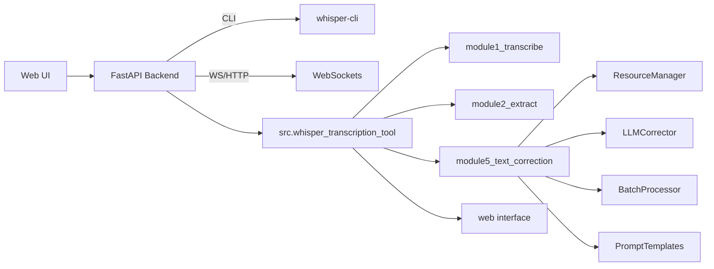

# Architektur & Komponenten

## Gesamtübersicht
Das System folgt einer modularen Architektur mit klaren Verantwortlichkeiten pro Modul.

## Module im Detail
- **module1_transcribe** – Orchestriert Whisper-Transkription, Event-Publishing, Output-Formate.
- **module2_extract** – Video-Extraktion (FFmpeg), Thumbnail-Service, Audio-Konverter (Opus→MP3).
- **module5_text_correction** – LeoLM-basierte Post-Korrektur, Resource Manager, Chunking.
- **web** – FastAPI-Routen, Jinja-Templates, Static Assets, WebSocket-Endpunkte.

## Datenflüsse
1. **Upload → Transkription:** UI sendet Multipart an `/api/transcribe`; module1 ruft Whisper CLI.
2. **Transkription → Korrektur:** Optionaler Schritt, `module5_text_correction` übernimmt nach Success.
3. **Korrektur → Output:** Dateien landen in `transcriptions/`, optional JSON-Metadaten.
4. **Events → UI:** WebSocket broadcastet Progress, Fehler, Abschluss.

## Konfigurationsquellen
- `~/.whisper_tool.json` – Laufzeitkonfiguration.
- `config.py` – Defaultwerte, Laden/Speichern.
- CLI-Flags & Umgebungsvariablen.

## Qualitätssicherung
- `tests/` – Unit & Integration (pytest, playwright-mcp Assets).
- `testing_archive/` – Explorative Scripts, Regression-Erinnerungen.

Weitere technische Details findest du im [Design-Dokument](https://github.com/cubetribe/WhisperCC_MacOS_Local/blob/main/.kiro/specs/llm-text-correction/design.md) und in den Quellmodulen.
